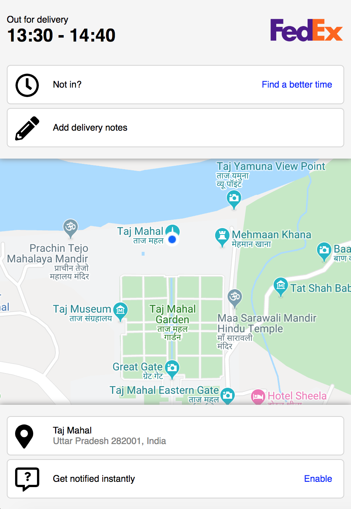

# :package: Package delivery scheduler :package:

This is Guillaume's package delivery scheduler:
a simple 1-pager webpage for recipients to see what time their package is scheduled to arrive.

- The Map section uses Google Maps.
- the marker is shown at the correct address.
- Changing delivery time and subscribing to notifications are just mock ups for now.
- The user is able to add notes to the delivery.

## How to run it locally:

```
git clone git@github.com:GBouffard/package-delivery-scheduler.git
cd package-delivery-scheduler
npm install
```

You then will need to add your Google Map api key with the environment variables.

```
touch .env && echo \"REACT_APP_GOOGLE_MAP_API_KEY=''\" > .env
// then open .env with your editor and enter the value of your google map APi key
npm start
```

## Technologies used:

- JavaScript
- ES6
- Create-react-app
- React
- React-DOM
- Sass
- Flexbox
- Font-Awesome
- Google Maps React
- React Geocode

## previews:

Desktop:


Mobile:

